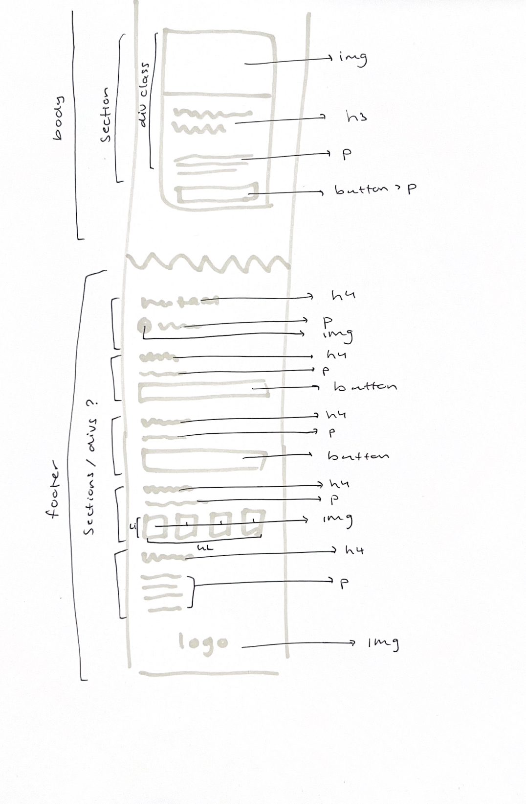

# Procesverslag
Markdown is een simpele manier om HTML te schrijven.  
Markdown cheat cheet: [Hulp bij het schrijven van Markdown](https://github.com/adam-p/markdown-here/wiki/Markdown-Cheatsheet).

Nb. De standaardstructuur en de spartaanse opmaak van de README.md zijn helemaal prima. Het gaat om de inhoud van je procesverslag. Besteedt de tijd voor pracht en praal aan je website.

Nb. Door *open* toe te voegen aan een *details* element kun je deze standaard open zetten. Fijn om dat steeds voor de relevante stuk(ken) te doen.

## Jij

  
uitwerken voor kick-off werkgroep

  ### Auteur:
  Chiara Karsonopoero

  #### Je startniveau:
  Rood

  #### Je focus:
  Responsive
 

## Je website

  
uitwerken voor kick-off werkgroep

  ### Je opdracht:
  [(https://www.porsche.com/netherlands/nl/)]

  #### Screenshot(s) van de eerste pagina (small screen): 
  [Porsche homepage  ](https://www.porsche.com/netherlands/nl/)
  

  #### Screenshot(s) van de tweede pagina (small screen):
  [Porsche detailpagina ](https://www.porsche.com/netherlands/nl/models/911/911-turbo-models/911-turbo-s/)
  
 

## Toegankelijkheidstest 1/2 (week 1)

  
uitwerken na test in 2e werkgroep

  ### Bevindingen
  Lijst met je bevindingen die in de test naar voren kwamen:

- autoplay op homepage, wel pauzeer knop aanwezig (zelfde geldt voor carrousel)
- over het algemeen responsive, alleen de footer slordig. tekst is niet leesbaar en buttons vallen buiten de view
- geen darkmodus

Voice Over:
- begint goed bij de nav van links naar rechts
- navigeert op logische wijze door de pagina heen
- Homepage ('drie modellen') alleen pijltje als link aangegeven
- Noemt alle onderdelen van carousel en slide daarna verder
- Afbeeldingen hebben alt teksten
- Video's hebben alt teksten
  

 
 
 
 
 

## Breakdownschets (week 1)

  
uitwerken na afloop 3e werkgroep

  ### de hele pagina: 
    
  

  ### dynamisch deel (bijv menu): 
  
  

## Voortgang 1 (week 2)

  
uitwerken voor 1e voortgang

  ### Stand van zaken
  hier dit ging goed & dit was lastig (neem ook screenshots op van delen van je website en code)

eerste les afwezig vanwege kickoff in berlijn en tweede door persoonlijke reden

thuis alles op dlo doorgenomen en slides bekeken en site gekozen. vervolgens een breakdown schets gemaakt en ook gelijk de volledige html van beide sites erin gezet. vanaf nu ligt de focus op de css

  ### Agenda voor meeting
  samen met je groepje opstellen

1. Hoe kan ik forms goed uitwerken, zoals een email input field
2. Navigatie bar die zelf links heeft, met extra links er onder. Links kunnen alleen niet in links zitten. Hoe moet dit opgelost worden?
3. 2 korte vraagjes over headers en of daar per se een tekst onder moet staan en hoe het ook alweer zat met SVG bestanden.
4. font inladen
5. carousel maken
6. een bepaald hover effect in een <UL> maken

  ### Verslag van meeting
  hier na afloop snel de uitkomsten van de meeting vastleggen

  - classes eruitgehaald
  - volgorde verbeterd
  - carrousel verwijderd > later in css
  - img grootes uit html > in css doen

## Voortgang 2 (week 3)

  
uitwerken voor 2e voortgang

  ### Stand van zaken
  - elke les aanwezig > actief meegedaan met lesopdrachten
  - opdracht hamburger menu meegedaan > nu zelf implementeren in code
  - meer focus op codepen opdrachten dan eigen site > dit weekend css bijwerken

  ### Agenda voor meeting
  samen met je groepje opstellen

1. hoe los ik het probleem met mijn carrousel op?
2. hoe moet ik werken met bepaalde foto’s waar text op staat
3. Hoe werk ik met een SVG Logo.
4. Veel verschillende styling voor headers en andere elementen, hoe opstellen in style sheet zonder classes en heel veel uitzonderingen maken.
5. hoe kan ik mijn menu verbergen in een hamburger menu?
6. hoe maak ik mijn carousel werkend 

  ### Verslag van meeting
  hier na afloop snel de uitkomsten van de meeting vastleggen

  - bij daphne meegekeken met haar carrousel > dvw aanpassen
  - meegekeken met indeling van nav > li of aparte secties
  - gekeken naar hoe je een bepaald woord meer nadruk kan geven > met em
  - hoe je een woord/tekst een background image kan geven > background-clip:text; en color:transparent;
  - ! font niet van google maar zelf eerst downloaden en die gebruiken
  - ! duidelijke color structure aanmaken

## Toegankelijkheidstest 2/2 (week 4)

  
uitwerken na test in 9e werkgroep

  ### Bevindingen
  Lijst met je bevindingen die in de test naar voren kwamen (geef ook aan wat er verbeterd is):

Porsche: autoplay homepage
Chiara: geen autoplay, onverwacht bewegende beelden kan trigger zijn > oplossing: zelf handmatig video aanzetten met knop rechtsonder in de homepage

Porsche: footer slordig en tekst afgeknipt dus onleesbaar
Chiara: footer volledig leesbaar en buttons responsive

Porsche: geen darkmodus
Chiara: wel darkmodus (note: staat op homepage, maar handiger in menu zodat je makkelijk kan aanpassen)

  Voice Over:
  - begint bij de nav van links naar rechts
  - ziet hamburgermenu items als groep van naam + icon (hierdoor realisatie icon geen alt tekst maar naar # aanpassen)
  - carrousel: gaat elk item af en scrollt dan zelf ook door naar de volgende. laatste list item afgerond = terug naar begin
  - darkmode & pauze buttons als getal voorgelezen > alt tekst toegevoegd
  - list decoratie nog niet weggehaald > nu wel en decoratie dus niet voorgelezen

 
 
 
 
 
 

## Voortgang 3 (week 4)

  
uitwerken voor 3e voortgang

  ### Stand van zaken
  hier dit ging goed & dit was lastig (neem ook screenshots op van delen van je website en code)

- pagina 1 bijna helemaal af
- hamburger menu nog doen (!)
- verder werken aan pagina 2 en beginnen aan de surface planes (deels code van vorig jaar)

  ### Agenda voor meeting
  samen met je groepje opstellen

- mov exporteren van de site en in code zetten
- carrousel (met mov's)
- Het maken van een hamburger menu. (Kan ik daar uitkomen door de les terug te kijken van java script? sinds ik die gemist heb)
Feedback op goed responsive maken van de website.
Carousel verbeteren
- hamburger menu is wederom gebroken. 
- nog een probleem met de nav bar
-  weer probleem met github
-  moet ik bepaalde filmpjes toevoegen of is thumbnail genoeg
-  hoe krijg ik de scrollbar weg en de puntjes omhoog
-  Hoe ik mijn lege <a> tags een transitie kan geven
-  en ook hoe ik een carousel met filmpjes maak

  ### Verslag van meeting
  hier na afloop snel de uitkomsten van de meeting vastleggen

  - websites van elkaar doorgegaan

LAATSTE LES
  - navigeren door de kopjes bij toegankelijkheid
  - hoe je de stem veranderd (niet met tab maar andere shortcut)
  - uit jezelf kunnen navigeren op mondeling dus zonder hulp (spiekbriefje mag)
  - stel je komt er last minute achter dat iets niet klopt > zet het in read.me en laat zien dat je er bewust van bent
  - wcag invullen: van nee naar ja gaan
  - aangeven wat jij hebt verbeterd op de site
  - focusstate toevoegen met custom property (var kleur)

## Eindgesprek (week 5) (=> Laatste voortgangsgesprek)

  
uitwerken voor eindgesprek

  ### Je uitkomst - karakteristiek screenshots:
  

  ### Dit ging goed/Heb ik geleerd: 
  Korte omschrijving met plaatjes
Ik ben het meest trots op mijn hamburger menu. Dit was vorig jaar de hoofdoorzaak waarom ik het vak niet had gehaald, en nu is dat wel gelukt! Het heeft me wel lang geduurd in totaal, zo'n 6 uur gok ik. Ik wilde namelijk een transition in de icon van hamburger naar kruisje - wat gelukt was, maar niet lukte met z-index om het op de juiste plek te krijgen. Vooral dat laatste heeft mij echt veel tijd gekost om erachter te komen waar het aan ligt. Uiteindelijk heb ik het menu op de manier gedaan als hoe het op de originele site is. 

Ook heb ik vorig jaar overal (ja, echt overal) gebruik gemaakt van classes. Ik wist niet eens hoe het op een andere manier kon, en nu kon ik tutorials volgen waarbij er classes werden gebruikt en ik dat zelf kon implementeren met elementen als nth-of-type en de juiste aanspreekpunten. Het duurde even tot ik dit helemaal onder de knie had, maar toen ik het eenmaal begreep was het heel chill toe te passen. Wel vind ik het op deze manier wat lastiger terug vinden wat je precies aanspreekt, maar met kleine tekstjes er zelf bij gezet, werkte het prima!

  

  ### Dit was lastig/Is niet gelukt:
  Korte omschrijving met plaatjes

  Zoals ik hierboven heb geschreven heeft de animatie van het hamburgermenu naar kruisje mij lang gekost. De animatie zelf lukte al snel met de tutorial, maar de plaatsing ervan niet. Hetgeen waar ik tegenaan liep was was de z-index. Het menu stond op de juiste plek, maar zodra de sidemenu uitklapte kwam het erachter te staan of kwam de volledige nav bar erop te staan - niet enkel de hamburger. ik heb hierbij de hulp van chat ingeschakeld en hele specifieke prompts gegeven, maar ook dit hielp niet. Het is me ook niet meer gelukt om erachter te komen, jammer, want ik ben nu wel erg benieuwd. (ik heb de code hiervan onderin mijn css laten staan om te laten zien dat ik hier actief mee aan de slag ben gegaan, ondanks het resultaat niet is geworden als hoe ik zou willen)

  

## Eindgesprek

Op basis van mijn laatste voortgangsgesprek ben ik nog hard aan de bak gegaan. Ik dacht dat ik op schema liep, maar kwam er tijdens dit gesprek achter dat ik veel te veel vasthield aan hetgeen dat ik vorig jaar tijdens FED heb geleerd. Ik was mij hier niet bewust van, maar ben daar dus gelukkig nog voor het eindgesprek achter gekomen. In dit voortgangsgesprek heb ik om veel feedback gevraagd en is het mij veel duidelijker geworden wat er van mij verwacht wordt. Ik heb hele delen code geschrapt en volledig opnieuw geschreven, deze keer volgens de regels van dit jaar. Ook had ik surface planes van vorig jaar letterlijk overgenomen (met de gedachte dat dat goed was), maar omdat het al een jaar geleden was kon de code ook niet meer uitleggen. Naar aanleiding van het gesprek heb ik dat dus ook veranderd. Sommige delen heb ik daarvan wel kunnen gebruiken, maar wel zelf aangepast met de kennis van nu en nog bronnen bijgezocht. 
Ik heb feedback gekregen over de verwachtingen van surface plane en na het gesprek heb ik hier gelijk een to do list van gemaakt. Zo had ik overzicht voor mijzelf wat er nog allemaal gedaan moest worden. 

  

 

## Bronnenlijst

  
continu bijhouden terwijl je werkt

  Nb. Wees specifiek ('css-tricks' als bron is bijv. niet specifiek genoeg). 
  Nb. ChatGpT en andere AI horen er ook bij.
  Nb. Vermeld de bronnen ook in je code.

  1. Gradient nav: https://www.w3schools.com/css/css3_gradients.asp
  2. .
  3. 
  4. Shortcuts (hulp van Lucas vorig jaar)
  5. Hamburger menu: https://www.youtube.com/watch?v=aNDqzlAKmZc
     https://codepen.io/chiarakars/pen/KwVpxZR
  6. .
  7. .
  8. .
  9. Scroll animatie met button (met groepje vorig jaar)

